# ERD — DAURIN: Marketplace Daur Ulang Terintegrasi
**Tim Mie Ayam Solo • PLAY IT! 2026 • Hackathon Web Application**

> Data Architect: Claude (Anthropic)
> Versi: 1.0 — Disesuaikan penuh dengan studi kasus & PRD v2

---

## 1. Entity Relationship Diagram (Mermaid)

```mermaid
erDiagram

  %% ─────────────────────────────────────────
  %% CORE: USER & IDENTITY
  %% ─────────────────────────────────────────

  USERS {
    uuid        id                PK
    varchar     name
    varchar     email             UK
    varchar     password_hash
    enum        role              "rumah_tangga | pengepul | industri"
    decimal     latitude
    decimal     longitude
    varchar     address
    varchar     phone
    varchar     avatar_url
    boolean     is_verified
    timestamp   created_at
    timestamp   updated_at
  }

  COLLECTOR_PROFILES {
    uuid        id                PK
    uuid        user_id           FK
    varchar     vehicle_type      "motor | gerobak | mobil pick-up"
    decimal     coverage_radius_km
    varchar     operational_area
    timestamp   created_at
  }

  COLLECTOR_WASTE_TYPES {
    uuid        id                PK
    uuid        collector_id      FK
    enum        waste_type        "plastik_pet | plastik_hdpe | kertas | kardus | logam | kaleng | kaca | elektronik"
  }

  INDUSTRY_PROFILES {
    uuid        id                PK
    uuid        user_id           FK
    varchar     company_name
    varchar     industry_type
    decimal     monthly_capacity_kg
    varchar     npwp
    timestamp   created_at
  }

  %% ─────────────────────────────────────────
  %% WASTE LISTINGS (Rumah Tangga → Pengepul)
  %% ─────────────────────────────────────────

  WASTE_LISTINGS {
    uuid        id                PK
    uuid        user_id           FK   "FK → USERS (rumah_tangga)"
    enum        waste_type        "plastik_pet | plastik_hdpe | kertas | kardus | logam | kaleng | kaca | elektronik"
    decimal     weight_kg
    varchar     description
    varchar     photo_url
    varchar     ai_classification
    decimal     ai_confidence_score
    decimal     price_per_kg
    decimal     total_price
    decimal     latitude
    decimal     longitude
    varchar     pickup_address
    enum        status            "tersedia | diklaim | diambil | selesai | dibatalkan"
    timestamp   created_at
    timestamp   updated_at
  }

  PICKUP_CLAIMS {
    uuid        id                PK
    uuid        listing_id        FK   "FK → WASTE_LISTINGS"
    uuid        collector_id      FK   "FK → USERS (pengepul)"
    enum        status            "diklaim | dalam_perjalanan | diambil | selesai"
    decimal     final_price
    timestamp   claimed_at
    timestamp   picked_at
    timestamp   completed_at
  }

  %% ─────────────────────────────────────────
  %% MATERIAL LISTINGS (Pengepul → Industri)
  %% ─────────────────────────────────────────

  MATERIAL_LISTINGS {
    uuid        id                PK
    uuid        collector_id      FK   "FK → USERS (pengepul)"
    uuid        source_claim_id   FK   "FK → PICKUP_CLAIMS (opsional, traceability)"
    enum        material_type     "flake_pet | flake_hdpe | kertas_olahan | besi_tua | aluminium | cullet_kaca | pcb_scrap"
    varchar     purpose           "deskripsi peruntukan industri"
    decimal     weight_kg
    decimal     price_per_kg
    varchar     photo_url
    varchar     description
    decimal     latitude
    decimal     longitude
    varchar     pickup_address
    enum        status            "tersedia | dipesan | terjual | dibatalkan"
    timestamp   created_at
    timestamp   updated_at
  }

  %% ─────────────────────────────────────────
  %% ORDER & NEGOTIATION (Industri ↔ Pengepul)
  %% ─────────────────────────────────────────

  ORDERS {
    uuid        id                PK
    uuid        buyer_id          FK   "FK → USERS (industri)"
    uuid        material_id       FK   "FK → MATERIAL_LISTINGS"
    decimal     requested_volume_kg
    decimal     final_price_per_kg
    decimal     final_total_price
    enum        status            "pending | negosiasi | deal | cancelled | selesai"
    varchar     buyer_note
    timestamp   created_at
    timestamp   updated_at
  }

  NEGOTIATIONS {
    uuid        id                PK
    uuid        order_id          FK   "FK → ORDERS"
    uuid        actor_id          FK   "FK → USERS"
    enum        action_type       "offer | counter_offer | deal | cancel"
    decimal     proposed_price_per_kg
    decimal     proposed_volume_kg
    text        message
    boolean     is_accepted
    timestamp   created_at
  }

  TRANSACTIONS {
    uuid        id                PK
    uuid        order_id          FK   "FK → ORDERS"
    decimal     amount
    enum        payment_status    "simulated | pending | completed"
    varchar     payment_reference
    timestamp   created_at
  }

  %% ─────────────────────────────────────────
  %% INDUSTRY PROCESSED OUTPUT (Bonus)
  %% ─────────────────────────────────────────

  PROCESSED_OUTPUTS {
    uuid        id                PK
    uuid        industry_id       FK   "FK → USERS (industri)"
    uuid        order_id          FK   "FK → ORDERS, bahan baku asalnya"
    varchar     product_name
    enum        output_type       "bahan_baku_jadi | produk_daur_ulang"
    decimal     weight_kg
    decimal     price_per_kg
    boolean     is_listed_for_sale
    enum        status            "tersedia | terjual"
    timestamp   created_at
  }

  %% ─────────────────────────────────────────
  %% ROUTE OPTIMIZATION (Pengepul)
  %% ─────────────────────────────────────────

  ROUTE_SESSIONS {
    uuid        id                PK
    uuid        collector_id      FK   "FK → USERS"
    decimal     start_latitude
    decimal     start_longitude
    decimal     total_distance_km
    decimal     estimated_fuel_cost
    json        route_order       "array of listing IDs in optimal sequence"
    timestamp   created_at
  }

  ROUTE_SESSION_CLAIMS {
    uuid        id                PK
    uuid        session_id        FK   "FK → ROUTE_SESSIONS"
    uuid        claim_id          FK   "FK → PICKUP_CLAIMS"
    int         visit_order
  }

  %% ─────────────────────────────────────────
  %% NOTIFICATION
  %% ─────────────────────────────────────────

  NOTIFICATIONS {
    uuid        id                PK
    uuid        user_id           FK   "FK → USERS"
    varchar     title
    text        body
    enum        type              "listing_claimed | listing_picked | order_placed | negotiation_update | deal_done | transaction"
    uuid        reference_id      "ID entitas terkait (listing/order/negotiation)"
    varchar     reference_type    "waste_listing | order | negotiation"
    boolean     is_read
    timestamp   created_at
  }

  %% ─────────────────────────────────────────
  %% RATING & REVIEW (Bonus)
  %% ─────────────────────────────────────────

  RATINGS {
    uuid        id                PK
    uuid        reviewer_id       FK   "FK → USERS"
    uuid        reviewee_id       FK   "FK → USERS"
    uuid        reference_id      "ID transaksi/pickup terkait"
    varchar     reference_type    "transaction | pickup_claim"
    int         score             "1-5"
    text        comment
    timestamp   created_at
  }

  %% ─────────────────────────────────────────
  %% IMPACT / DASHBOARD AGGREGASI
  %% ─────────────────────────────────────────

  IMPACT_LOGS {
    uuid        id                PK
    uuid        transaction_id    FK   "FK → TRANSACTIONS"
    enum        waste_type
    decimal     weight_kg
    decimal     co2_offset_kg     "berdasarkan tabel konversi EPA/IPCC"
    decimal     economic_value
    timestamp   created_at
  }

  %% ─────────────────────────────────────────
  %% CHAT REAL-TIME (Bonus, Supabase Realtime)
  %% ─────────────────────────────────────────

  CHAT_MESSAGES {
    uuid        id                PK
    uuid        negotiation_id    FK   "FK → NEGOTIATIONS"
    uuid        sender_id         FK   "FK → USERS"
    text        message
    boolean     is_read
    timestamp   created_at
  }

  %% ─────────────────────────────────────────
  %% RELATIONSHIPS
  %% ─────────────────────────────────────────

  USERS                  ||--o|  COLLECTOR_PROFILES          : "has"
  USERS                  ||--o|  INDUSTRY_PROFILES            : "has"
  COLLECTOR_PROFILES     ||--|{  COLLECTOR_WASTE_TYPES        : "handles"

  USERS                  ||--|{  WASTE_LISTINGS               : "creates"
  WASTE_LISTINGS         ||--o|  PICKUP_CLAIMS                : "claimed via"
  USERS                  ||--|{  PICKUP_CLAIMS                : "executes (as collector)"

  PICKUP_CLAIMS          ||--o{  MATERIAL_LISTINGS            : "sourced into"
  USERS                  ||--|{  MATERIAL_LISTINGS            : "lists (as collector)"

  MATERIAL_LISTINGS      ||--|{  ORDERS                       : "ordered via"
  USERS                  ||--|{  ORDERS                       : "places (as industry)"

  ORDERS                 ||--|{  NEGOTIATIONS                 : "negotiated through"
  USERS                  ||--|{  NEGOTIATIONS                 : "participates"

  ORDERS                 ||--o|  TRANSACTIONS                 : "settled via"
  ORDERS                 ||--o{  PROCESSED_OUTPUTS            : "produces"
  USERS                  ||--o{  PROCESSED_OUTPUTS            : "creates (as industry)"

  USERS                  ||--o{  ROUTE_SESSIONS               : "generates"
  ROUTE_SESSIONS         ||--|{  ROUTE_SESSION_CLAIMS         : "contains"
  PICKUP_CLAIMS          ||--o{  ROUTE_SESSION_CLAIMS         : "included in"

  USERS                  ||--o{  NOTIFICATIONS                : "receives"
  USERS                  ||--o{  RATINGS                      : "gives"
  USERS                  ||--o{  RATINGS                      : "receives"

  TRANSACTIONS           ||--o|  IMPACT_LOGS                  : "generates"
  NEGOTIATIONS           ||--o{  CHAT_MESSAGES                : "has"
  USERS                  ||--o{  CHAT_MESSAGES                : "sends"
```



---

## 2. Kamus Data (Data Dictionary)

### 2.1 `USERS` — Pengguna Platform (Semua Peran)

| Kolom | Tipe | Constraint | Keterangan |
|---|---|---|---|
| `id` | UUID | PK, NOT NULL | Primary key, auto-generated |
| `name` | VARCHAR(100) | NOT NULL | Nama lengkap pengguna |
| `email` | VARCHAR(255) | UK, NOT NULL | Email unik, digunakan sebagai login |
| `password_hash` | VARCHAR(255) | NOT NULL | Hash bcrypt/argon2 |
| `role` | ENUM | NOT NULL | `rumah_tangga`, `pengepul`, `industri` |
| `latitude` | DECIMAL(10,7) | NULLABLE | Koordinat lokasi (dari geolocation API) |
| `longitude` | DECIMAL(10,7) | NULLABLE | Koordinat lokasi |
| `address` | VARCHAR(500) | NULLABLE | Alamat lengkap |
| `phone` | VARCHAR(20) | NULLABLE | Nomor telepon |
| `avatar_url` | VARCHAR(500) | NULLABLE | URL foto profil |
| `is_verified` | BOOLEAN | DEFAULT false | Status verifikasi akun |
| `created_at` | TIMESTAMP | DEFAULT NOW() | Waktu registrasi |
| `updated_at` | TIMESTAMP | DEFAULT NOW() | Waktu update terakhir |

---

### 2.2 `COLLECTOR_PROFILES` — Profil Tambahan Pengepul

| Kolom | Tipe | Constraint | Keterangan |
|---|---|---|---|
| `id` | UUID | PK | |
| `user_id` | UUID | FK → USERS, UNIQUE | Satu pengepul satu profil |
| `vehicle_type` | VARCHAR(50) | NULLABLE | Jenis kendaraan: motor, gerobak, pickup |
| `coverage_radius_km` | DECIMAL(5,2) | DEFAULT 5.0 | Radius operasional dalam km |
| `operational_area` | VARCHAR(200) | NULLABLE | Deskripsi wilayah operasional |
| `created_at` | TIMESTAMP | DEFAULT NOW() | |

---

### 2.3 `COLLECTOR_WASTE_TYPES` — Jenis Sampah yang Ditangani Pengepul

| Kolom | Tipe | Constraint | Keterangan |
|---|---|---|---|
| `id` | UUID | PK | |
| `collector_id` | UUID | FK → COLLECTOR_PROFILES | Relasi ke profil pengepul |
| `waste_type` | ENUM | NOT NULL | Jenis sampah yang bisa ditangani |

> **Enum `waste_type`:** `plastik_pet`, `plastik_hdpe`, `kertas`, `kardus`, `logam`, `kaleng`, `kaca`, `elektronik`

---

### 2.4 `WASTE_LISTINGS` — Listing Sampah oleh Rumah Tangga

| Kolom | Tipe | Constraint | Keterangan |
|---|---|---|---|
| `id` | UUID | PK | |
| `user_id` | UUID | FK → USERS | Pemilik listing (peran: rumah_tangga) |
| `waste_type` | ENUM | NOT NULL | Jenis sampah sesuai taksonomi |
| `weight_kg` | DECIMAL(8,2) | NOT NULL | Berat estimasi dalam kg |
| `description` | TEXT | NULLABLE | Deskripsi kondisi sampah |
| `photo_url` | VARCHAR(500) | NOT NULL | URL foto sampah di Supabase Storage |
| `ai_classification` | VARCHAR(50) | NULLABLE | Hasil prediksi AI (label kelas) |
| `ai_confidence_score` | DECIMAL(5,2) | NULLABLE | Confidence score AI (0–100%) |
| `price_per_kg` | DECIMAL(10,2) | NOT NULL | Harga jual per kg yang diminta RT |
| `total_price` | DECIMAL(12,2) | GENERATED | `weight_kg × price_per_kg` |
| `latitude` | DECIMAL(10,7) | NOT NULL | Lokasi pengambilan |
| `longitude` | DECIMAL(10,7) | NOT NULL | Lokasi pengambilan |
| `pickup_address` | VARCHAR(500) | NULLABLE | Alamat teks pengambilan |
| `status` | ENUM | DEFAULT `tersedia` | `tersedia`, `diklaim`, `diambil`, `selesai`, `dibatalkan` |
| `created_at` | TIMESTAMP | DEFAULT NOW() | |
| `updated_at` | TIMESTAMP | DEFAULT NOW() | |

---

### 2.5 `PICKUP_CLAIMS` — Klaim & Pengambilan oleh Pengepul

| Kolom | Tipe | Constraint | Keterangan |
|---|---|---|---|
| `id` | UUID | PK | |
| `listing_id` | UUID | FK → WASTE_LISTINGS, UNIQUE | Satu listing hanya satu claim aktif |
| `collector_id` | UUID | FK → USERS | Pengepul yang mengklaim |
| `status` | ENUM | DEFAULT `diklaim` | `diklaim`, `dalam_perjalanan`, `diambil`, `selesai` |
| `final_price` | DECIMAL(12,2) | NULLABLE | Harga final yang disepakati saat pengambilan |
| `claimed_at` | TIMESTAMP | DEFAULT NOW() | Waktu klaim dilakukan |
| `picked_at` | TIMESTAMP | NULLABLE | Waktu sampah fisik diambil |
| `completed_at` | TIMESTAMP | NULLABLE | Waktu transaksi RT selesai |

---

### 2.6 `MATERIAL_LISTINGS` — Listing Bahan Baku oleh Pengepul

| Kolom | Tipe | Constraint | Keterangan |
|---|---|---|---|
| `id` | UUID | PK | |
| `collector_id` | UUID | FK → USERS | Pemilik listing (peran: pengepul) |
| `source_claim_id` | UUID | FK → PICKUP_CLAIMS, NULLABLE | Traceability: dari pickup mana bahan baku berasal |
| `material_type` | ENUM | NOT NULL | Jenis bahan baku hasil pilahan |
| `purpose` | VARCHAR(255) | NULLABLE | Deskripsi peruntukan untuk industri |
| `weight_kg` | DECIMAL(10,2) | NOT NULL | Berat tersedia dalam kg |
| `price_per_kg` | DECIMAL(10,2) | NOT NULL | Harga awal yang ditawarkan |
| `photo_url` | VARCHAR(500) | NULLABLE | Foto bahan baku |
| `description` | TEXT | NULLABLE | Keterangan kualitas bahan baku |
| `latitude` | DECIMAL(10,7) | NOT NULL | Lokasi bahan baku tersedia |
| `longitude` | DECIMAL(10,7) | NOT NULL | |
| `pickup_address` | VARCHAR(500) | NULLABLE | |
| `status` | ENUM | DEFAULT `tersedia` | `tersedia`, `dipesan`, `terjual`, `dibatalkan` |
| `created_at` | TIMESTAMP | DEFAULT NOW() | |
| `updated_at` | TIMESTAMP | DEFAULT NOW() | |

> **Enum `material_type`:** `flake_pet`, `flake_hdpe`, `kertas_olahan`, `besi_tua`, `aluminium`, `cullet_kaca`, `pcb_scrap`

---

### 2.7 `ORDERS` — Pesanan Industri ke Pengepul

| Kolom | Tipe | Constraint | Keterangan |
|---|---|---|---|
| `id` | UUID | PK | |
| `buyer_id` | UUID | FK → USERS | Industri yang memesan |
| `material_id` | UUID | FK → MATERIAL_LISTINGS | Bahan baku yang dipesan |
| `requested_volume_kg` | DECIMAL(10,2) | NOT NULL | Volume yang dibutuhkan |
| `final_price_per_kg` | DECIMAL(10,2) | NULLABLE | Harga final setelah deal |
| `final_total_price` | DECIMAL(14,2) | NULLABLE | Total transaksi setelah deal |
| `status` | ENUM | DEFAULT `pending` | `pending`, `negosiasi`, `deal`, `cancelled`, `selesai` |
| `buyer_note` | TEXT | NULLABLE | Catatan kebutuhan dari industri |
| `created_at` | TIMESTAMP | DEFAULT NOW() | |
| `updated_at` | TIMESTAMP | DEFAULT NOW() | |

---

### 2.8 `NEGOTIATIONS` — Thread Negosiasi Harga

| Kolom | Tipe | Constraint | Keterangan |
|---|---|---|---|
| `id` | UUID | PK | |
| `order_id` | UUID | FK → ORDERS | Negosiasi untuk order ini |
| `actor_id` | UUID | FK → USERS | Pengirim tawaran (industri atau pengepul) |
| `action_type` | ENUM | NOT NULL | `offer`, `counter_offer`, `deal`, `cancel` |
| `proposed_price_per_kg` | DECIMAL(10,2) | NOT NULL | Harga yang ditawarkan |
| `proposed_volume_kg` | DECIMAL(10,2) | NULLABLE | Volume yang diusulkan |
| `message` | TEXT | NULLABLE | Pesan pendamping penawaran |
| `is_accepted` | BOOLEAN | DEFAULT false | Apakah pihak lain menerima tawaran ini |
| `created_at` | TIMESTAMP | DEFAULT NOW() | |

> **State Machine Negosiasi:**
> `offer` → `counter_offer` ↔ (multi-putaran) → `deal` atau `cancel`
> Saat `deal`, status ORDER berubah ke `deal` dan `MATERIAL_LISTINGS` ke `dipesan`.

---

### 2.9 `TRANSACTIONS` — Pencatatan Transaksi Final

| Kolom | Tipe | Constraint | Keterangan |
|---|---|---|---|
| `id` | UUID | PK | |
| `order_id` | UUID | FK → ORDERS, UNIQUE | Satu order satu transaksi |
| `amount` | DECIMAL(14,2) | NOT NULL | Nominal transaksi = `final_total_price` dari order |
| `payment_status` | ENUM | DEFAULT `simulated` | `simulated`, `pending`, `completed` |
| `payment_reference` | VARCHAR(100) | NULLABLE | Referensi simulasi pembayaran |
| `created_at` | TIMESTAMP | DEFAULT NOW() | |

---

### 2.10 `ROUTE_SESSIONS` — Sesi Optimasi Rute Pengepul

| Kolom | Tipe | Constraint | Keterangan |
|---|---|---|---|
| `id` | UUID | PK | |
| `collector_id` | UUID | FK → USERS | Pengepul yang menggunakan fitur rute |
| `start_latitude` | DECIMAL(10,7) | NOT NULL | Posisi awal pengepul |
| `start_longitude` | DECIMAL(10,7) | NOT NULL | |
| `total_distance_km` | DECIMAL(8,2) | NULLABLE | Estimasi total jarak perjalanan |
| `estimated_fuel_cost` | DECIMAL(10,2) | NULLABLE | Estimasi biaya bensin (Rp) |
| `route_order` | JSONB | NOT NULL | Array listing ID dalam urutan optimal: `["uuid1","uuid2",...]` |
| `created_at` | TIMESTAMP | DEFAULT NOW() | |

---

### 2.11 `ROUTE_SESSION_CLAIMS` — Detail Urutan Klaim dalam Sesi Rute

| Kolom | Tipe | Constraint | Keterangan |
|---|---|---|---|
| `id` | UUID | PK | |
| `session_id` | UUID | FK → ROUTE_SESSIONS | |
| `claim_id` | UUID | FK → PICKUP_CLAIMS | Klaim yang termasuk dalam rute |
| `visit_order` | INT | NOT NULL | Urutan kunjungan (1, 2, 3, …) |

---

### 2.12 `NOTIFICATIONS` — Notifikasi Sistem

| Kolom | Tipe | Constraint | Keterangan |
|---|---|---|---|
| `id` | UUID | PK | |
| `user_id` | UUID | FK → USERS | Penerima notifikasi |
| `title` | VARCHAR(200) | NOT NULL | Judul notifikasi |
| `body` | TEXT | NOT NULL | Isi pesan notifikasi |
| `type` | ENUM | NOT NULL | Jenis trigger notifikasi |
| `reference_id` | UUID | NULLABLE | ID entitas pemicu |
| `reference_type` | VARCHAR(50) | NULLABLE | Tipe entitas pemicu |
| `is_read` | BOOLEAN | DEFAULT false | Status baca |
| `created_at` | TIMESTAMP | DEFAULT NOW() | |

> **Enum `type`:** `listing_claimed`, `listing_picked`, `order_placed`, `negotiation_update`, `deal_done`, `transaction`

---

### 2.13 `IMPACT_LOGS` — Log Dampak Lingkungan

| Kolom | Tipe | Constraint | Keterangan |
|---|---|---|---|
| `id` | UUID | PK | |
| `transaction_id` | UUID | FK → TRANSACTIONS | Transaksi yang memicu log ini |
| `waste_type` | ENUM | NOT NULL | Jenis material yang didaur ulang |
| `weight_kg` | DECIMAL(10,2) | NOT NULL | Berat material |
| `co2_offset_kg` | DECIMAL(10,4) | NOT NULL | CO2 yang berhasil dihindari (konversi EPA/IPCC) |
| `economic_value` | DECIMAL(12,2) | NOT NULL | Nilai ekonomi transaksi |
| `created_at` | TIMESTAMP | DEFAULT NOW() | |

> **Tabel Konversi CO2 Offset (EPA/IPCC):**
> - Plastik PET/HDPE: 1.75 kg CO2e/kg
> - Kertas/Kardus: 0.9 kg CO2e/kg
> - Logam/Aluminium: 8.75 kg CO2e/kg
> - Kaca: 0.4 kg CO2e/kg
> - Elektronik: 20.0 kg CO2e/kg

---

### 2.14 `RATINGS` — Sistem Rating & Ulasan (Bonus)

| Kolom | Tipe | Constraint | Keterangan |
|---|---|---|---|
| `id` | UUID | PK | |
| `reviewer_id` | UUID | FK → USERS | Pemberi rating |
| `reviewee_id` | UUID | FK → USERS | Penerima rating |
| `reference_id` | UUID | NOT NULL | ID transaksi/pickup terkait |
| `reference_type` | VARCHAR(50) | NOT NULL | `transaction` atau `pickup_claim` |
| `score` | INT | CHECK (1–5) | Skor bintang |
| `comment` | TEXT | NULLABLE | Komentar ulasan |
| `created_at` | TIMESTAMP | DEFAULT NOW() | |

---

### 2.15 `CHAT_MESSAGES` — Chat Real-Time Negosiasi (Bonus)

| Kolom | Tipe | Constraint | Keterangan |
|---|---|---|---|
| `id` | UUID | PK | |
| `negotiation_id` | UUID | FK → NEGOTIATIONS | Thread negosiasi terkait |
| `sender_id` | UUID | FK → USERS | Pengirim pesan |
| `message` | TEXT | NOT NULL | Isi pesan |
| `is_read` | BOOLEAN | DEFAULT false | Status baca penerima |
| `created_at` | TIMESTAMP | DEFAULT NOW() | |

---

## 3. Alur Status (State Machine)

### 3.1 Status `WASTE_LISTINGS`

```
[tersedia]
    │
    ▼ (pengepul klaim)
[diklaim]
    │
    ▼ (pengepul tiba & ambil)
[diambil]
    │
    ▼ (pickup selesai, RT terima pembayaran)
[selesai]

Dari [tersedia] atau [diklaim]:
    ──► [dibatalkan]  (RT atau pengepul batal)
```

### 3.2 Status `PICKUP_CLAIMS`

```
[diklaim] → [dalam_perjalanan] → [diambil] → [selesai]
```

### 3.3 Status `ORDERS` & `NEGOTIATIONS`

```
ORDER:   [pending] → [negosiasi] → [deal] → [selesai]
                           │
                           └──► [cancelled]

NEGOTIATIONS:
  offer → counter_offer → counter_offer → ... → deal
                                             └──► cancel
```

### 3.4 Status `MATERIAL_LISTINGS`

```
[tersedia] → [dipesan] → [terjual]
     └──────────────────► [dibatalkan]
```

---

## 4. Indeks yang Direkomendasikan

```sql
-- Pencarian marketplace listing sampah berdasarkan jenis & status
CREATE INDEX idx_waste_listings_type_status ON waste_listings(waste_type, status);

-- Filter pengepul berdasarkan wilayah (geolocation)
CREATE INDEX idx_waste_listings_location ON waste_listings(latitude, longitude);
CREATE INDEX idx_material_listings_location ON material_listings(latitude, longitude);

-- Marketplace bahan baku berdasarkan jenis & status
CREATE INDEX idx_material_listings_type_status ON material_listings(material_type, status);

-- Query order per user
CREATE INDEX idx_orders_buyer_id ON orders(buyer_id);
CREATE INDEX idx_orders_material_id ON orders(material_id);

-- Thread negosiasi per order
CREATE INDEX idx_negotiations_order_id ON negotiations(order_id);

-- Notifikasi per user
CREATE INDEX idx_notifications_user_id_read ON notifications(user_id, is_read);

-- Impact log aggregasi (dashboard)
CREATE INDEX idx_impact_logs_waste_type ON impact_logs(waste_type);
CREATE INDEX idx_impact_logs_created_at ON impact_logs(created_at);
```

---

## 5. Relasi Ringkas (Summary)

| Dari | Ke | Kardinalitas | Keterangan |
|---|---|---|---|
| USERS | COLLECTOR_PROFILES | 1 : 0..1 | Satu pengepul punya satu profil |
| USERS | INDUSTRY_PROFILES | 1 : 0..1 | Satu industri punya satu profil |
| COLLECTOR_PROFILES | COLLECTOR_WASTE_TYPES | 1 : N | Satu pengepul bisa handle banyak jenis |
| USERS | WASTE_LISTINGS | 1 : N | RT bisa buat banyak listing |
| WASTE_LISTINGS | PICKUP_CLAIMS | 1 : 0..1 | Satu listing hanya satu claim aktif |
| USERS (pengepul) | PICKUP_CLAIMS | 1 : N | Satu pengepul bisa klaim banyak listing |
| PICKUP_CLAIMS | MATERIAL_LISTINGS | 1 : N | Satu pickup bisa hasilkan banyak bahan baku |
| MATERIAL_LISTINGS | ORDERS | 1 : N | Satu listing bisa punya banyak order (negosiasi) |
| ORDERS | NEGOTIATIONS | 1 : N | Satu order punya thread negosiasi multi-putaran |
| ORDERS | TRANSACTIONS | 1 : 0..1 | Satu order satu transaksi final |
| TRANSACTIONS | IMPACT_LOGS | 1 : 0..1 | Setiap transaksi catat dampak CO2 |
| USERS | ROUTE_SESSIONS | 1 : N | Pengepul bisa buat banyak sesi rute |
| NEGOTIATIONS | CHAT_MESSAGES | 1 : N | Thread negosiasi punya banyak pesan (bonus) |

---

## 6. Mapping ke Fitur Wajib (PRD → ERD)

| Fitur Wajib (Studi Kasus) | Tabel Utama yang Terlibat |
|---|---|
| FR-001: Autentikasi & RBAC | `USERS`, `COLLECTOR_PROFILES`, `INDUSTRY_PROFILES`, `COLLECTOR_WASTE_TYPES` |
| FR-002: Input & Listing Sampah RT | `WASTE_LISTINGS` |
| FR-002.2: AI Klasifikasi Foto | `WASTE_LISTINGS` (`ai_classification`, `ai_confidence_score`) |
| FR-003.1–3.2: Klaim & Ambil Listing | `PICKUP_CLAIMS`, `WASTE_LISTINGS` |
| FR-003.3: Peta Titik Pengambilan | `WASTE_LISTINGS` (`latitude`, `longitude`), `PICKUP_CLAIMS` |
| FR-003.4: Rute Optimal Nearest-Neighbor | `ROUTE_SESSIONS`, `ROUTE_SESSION_CLAIMS` |
| FR-003.6: Input Bahan Baku Pengepul | `MATERIAL_LISTINGS`, `PICKUP_CLAIMS` (traceability) |
| FR-004: Pemesanan & Negosiasi | `ORDERS`, `NEGOTIATIONS`, `TRANSACTIONS` |
| FR-005: Marketplace Landing | `WASTE_LISTINGS`, `MATERIAL_LISTINGS`, `PROCESSED_OUTPUTS` |
| FR-005.3: Dashboard CO2 | `IMPACT_LOGS`, `TRANSACTIONS` |
| Bonus: Chat Real-Time | `CHAT_MESSAGES`, `NEGOTIATIONS` |
| Bonus: Rating & Ulasan | `RATINGS` |
| Bonus: Traceability Material | `PICKUP_CLAIMS.source_claim_id` → `MATERIAL_LISTINGS` |
| Bonus: Bahan Baku Jadi Industri | `PROCESSED_OUTPUTS` |

---

*ERD Daurin v1.0 — Tim Mie Ayam Solo • PLAY IT! 2026*
*Dibuat sebagai panduan implementasi database selama 24 jam hackathon*